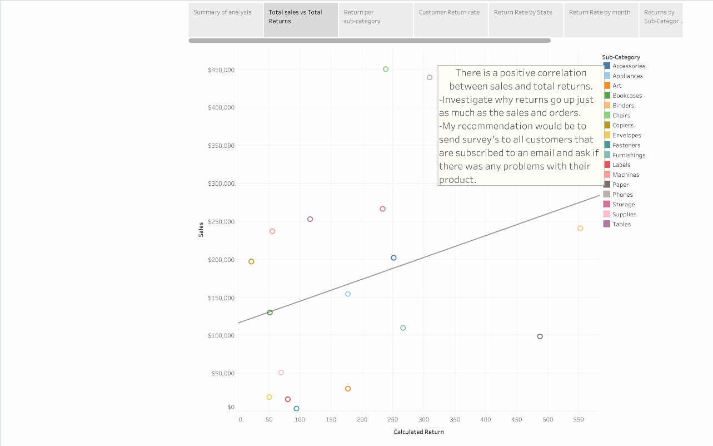
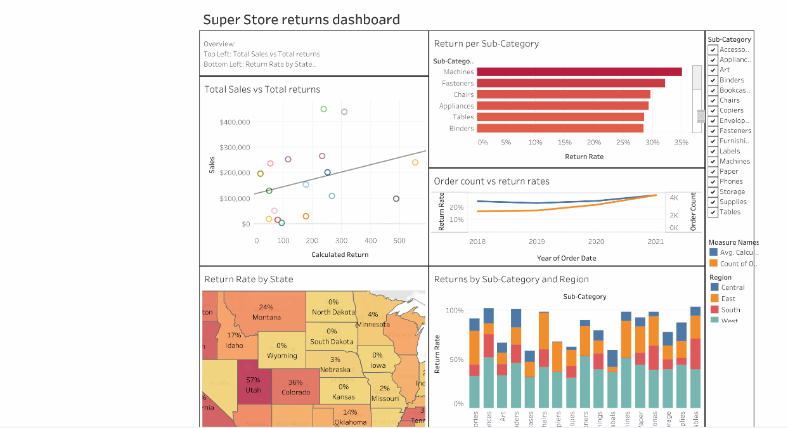

# 📦 Superstore Returns Analysis

## 🗂️ Project Overview

This project investigates the root causes of the high number of returned orders at the Superstore using **Tableau Desktop**. The goal is to help the CEO and stakeholders understand why customers are returning products and to provide actionable insights to reduce the volume of returns.

**Key Tasks Completed:**
- The `Returns` table was **LEFT JOINED** onto the `Orders` table to identify returned and non-returned orders.
- A **calculated field** was created to convert the `Returned` column to numeric format (`1` for “Yes”, `0` for `null`) for accurate return rate calculation.
- Multiple visual analyses were built to uncover trends and problem areas.
- An interactive **dashboard** and **story** were developed to share insights with decision-makers.

## 📊 Analysis

<a href = "https://github.com/MaWier22/Data_projects_TripleTen/blob/main/Superstore%20returns/SuperstoreReturns-1.pdf">Analysis Report</a> 
<a href = "https://public.tableau.com/views/Sprint5_17509879603310/Superstorereturns?:language=en-US&:sid=&:redirect=auth&:display_count=n&:origin=viz_share_link">Tableau Story</a>

**Visual Analyses Included:**
- **Scatterplot:** Correlation between total sales and total returns by product subcategory. This helps determine if higher sales naturally lead to more returns.
  
- **Bar Chart:** Return rate by product category, highlighting which categories have the highest and lowest return rates.
- **Customer View:** Return rate by customer, filtered to show only repeat customers to spot patterns in customer behavior.
- **Geographic Map:** Return rate by state to identify regional trends and concentrations of returned orders.
- **Time Series:** Return rate by month to examine any seasonal trends in product returns.
   

**Key Insights:**
- A **positive correlation** exists between sales and total returns — more sales often result in more returns.
- **Machines** and **Fasteners** have the highest return rates, while **Envelopes**, **Labels**, and **Art Supplies** have the lowest.
- States with the highest return rates include **Utah (57%)**, **California and Oregon (45%)**, and **Tennessee (38%)**.
- **August** shows the highest return rates, while **November** shows the lowest, suggesting possible seasonal effects.

## ✅ Conclusions

The project confirms that product returns are closely tied to product categories, geography, and seasonal patterns. Higher sales volumes naturally lead to more returns, but certain categories and locations have disproportionately high return rates, indicating possible quality or process issues.

The interactive Tableau **dashboard** and **story** allow stakeholders to:
- Drill down into problem categories and locations.
- Filter by subcategory, region, or time period.
- Identify specific areas for further investigation.

## 🔍 Recommendations

- **Customer Feedback:**  
  - Send surveys to customers, especially in high-return states, to gather insights about product issues and reasons for returns.

- **Supplier & Vendor Audits:**  
  - Investigate suppliers and manufacturers responsible for high-return product categories (e.g., Machines and Fasteners).
  - Check for quality control issues and supply chain inefficiencies.

- **Store & Regional Audits:**  
  - Visit stores in high-return states to inspect processes, product handling, and packaging.

- **Seasonal Monitoring:**  
  - Examine seasonal promotions or product launches that may contribute to high return rates in peak months like August.

- **Continuous Tracking:**  
  - Regularly update the dashboard to monitor progress and adjust strategies based on new data.

